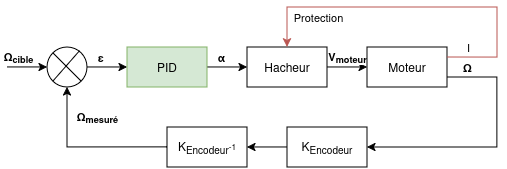
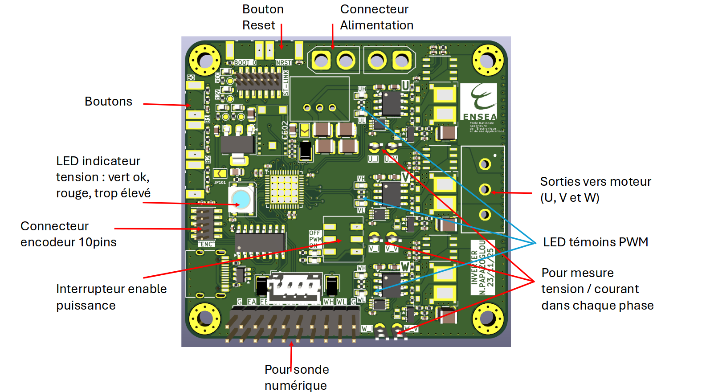

# TP : Asservissement de vitesse d’une machine à courant continu par PID numérique - Méthode de Ziegler-Nichols

# 1. Objectifs pédagogiques

Ce TP a pour objectif la mise en oeuvre d’un asservissement de vitesse d’une machine à courant continu (MCC) à l’aide d’un microcontrôleur STM32.

Les objectifs sont :

* Analyser une maquette réelle de commande numérique et l'architecture associée
* Comprendre la structure d’une boucle d’asservissement
* Régler expérimentalement un correcteur par la méthode de Ziegler–Nichols
* Implémenter un correcteur PID numérique
* Comprendre le passage du PID continu au PID discret
* Analyser les performances d’un asservissement
* Analyser l'influence de la période d'échantillonnage sur un asservissement numérique
  
---

# 2. Présentation du système expérimental

Le système étudié est constitué de :

* une machine à courant continu (48V, 10A, 500W, 3000 rpm)
* une maquette controleur de moteur composé de :
  * un pont en H de puissance
  * un codeur incrémental
  * un microcontrôleur STM32
* une commande PWM (4 signaux)

Le microcontrôleur réalise :

1. la mesure de vitesse via le codeur
2. la mesure de courant via des sondes à effet hall
3. la limitation de courant afin de ne pas détorioré le matériel
4. le calcul du correcteur PID sur la vitesse (à mettre en place)
5. la génération du signal PWM avec prise en charge des temps morts

Schéma fonctionnel :



Pour information, l'ensemble du hardware et du software sont disponibles [ici](https://github.com/DBXYD/Inverter_SQJQ910EL)

---

# 3. Modélisation de la machine à courant continu

Le modèle classique d'une MCC est décrit par les équations suivantes.

## Équation électrique

$$V(t) = Ri(t) + L \frac{di(t)}{dt} + K_e\Omega{}(t)$$

## Équation mécanique

$$J\frac{d\Omega(t)}{dt} + f\Omega(t) = K_ti(t)$$

avec :
* $V$ : tension appliquée
* $R$ : résistance d’induit
* $L$ : inductance d’induit
* $K_e$ : constante de force électromotrice
* $K_t$ : constante de couple
* $J$ : inertie
* $f$ : coefficient de frottement
* $\Omega$ : vitesse de rotation

Dans ce TP on ne réalise pas l’identification complète du moteur. On se place dans une approche expérimentale de réglage du correcteur.

---

# 4. Principe de l’asservissement

La vitesse réelle du moteur est mesurée par le codeur incrémental.

L’erreur est définie par :

$$ε(t) = Ω_{cible}(t) − Ω_{mesuré}(t)$$

Cette erreur sera traitée par un correcteur PID qui calcule la commande appliquée au moteur.

---

# 5. Correcteur PID continu

Le correcteur PID continu s’écrit :

$$u(t) = K_p (\epsilon(t) + \frac{1}{T_i} \int \epsilon(t) + T_d \frac{d\epsilon(t)}{dt})$$

avec :
* $K_p$ : gain proportionnel
* $T_i$ : constante de temps intégrateur
* $K_d$ : constante de temps dérivateur

Soit un correcteur de la forme : 

$$C(p) = K_p(1 + T_d p + \frac{1}{T_i p})$$

Rôle des actions :
* Action proportionnelle : rapidité
* Action intégrale : suppression de l’erreur statique
* Action dérivée : amélioration de la stabilité

---

# 6. Implémentation numérique

Le microcontrôleur calcule la commande à intervalles réguliers.

On note **Te** la période d’échantillonnage, et **Fe** la fréquence d'échantillonnage.

Les variables discrètes sont :
* e[k] : erreur à l’instant k
* u[k] : commande à l’instant k

---

# 7. Discrétisation du PID
Le PID discret peut être écrit sous la forme d'une équation aux différences qui sera à déterminer en fonction des paramètres du filtre établi. A partir de la formule de la transformée bilinéaire, **calculer** l'équation aux différences associé au filtre PID analogique. 

$$ p = \frac{2}{T_e}\frac{1-z^{-1}}{1+z^{-1}} $$

Le résultat sera mise sous la forme canonique à ce que la fonction de transfert d'une PID discret puisse s'écrire sous la forme : 

$$ H(z) = \frac{\sum_0^{N-1} b_k z^{-k}}{1 + \sum_0^{M-1} a_k z^{-k}} $$

**Déterminer : Les coefficients $a_k$ et $b_k$ en fonction de $K_p$, $T_i$, $T_d$ et $T_e$**
**Ecriver un script dans le langage de votre choix qui calculera très rapidement les coefficients en fonction des paramètres, vous aurez besoin à plusieures reprises de (re-)calculer les $a_k$, $b_k$**


---

# 8. Implémentation dans le code STM32
Le programme principal est fourni. A l'aide d'une interface UART, vous pouvez controler le hacheur et faire tourner le moteur, configurer le PID et afficher divers information. La console vous renverra un certain nombre d'informations comme la limite de courant atteinte, etc...

Les fonctions accessibles sont disponibles à l'aide de la commande **help**. Les fonctions peuvent avoir aucun, un ou plusieurs paramètres. 

Toutes les fonctions commençant par *set* écrivent une valeur.
Toutes les fonctions commençant par *get* récupèrent une valeur.

Il faut se référer à l'aide suivante :

| Fonction          | Description                               | Arguments                                         |
|-------------------|-------------------------------------------|---------------------------------------------------|
| setLed            | Allume la led RGB                         | setLED <uint8 R> <uint8 G> <uint8 B>              | 
| setDuty           | Règle le rapport cyclique à $\alpha$ (en boucle ouverte uniquement)     | setDuty cycle <$\alpha$>, $0 < \alpha < 1$        |
| setSpeedTarget    | Définit la vitesse cible du moteur (en boucle fermée uniquement)       | setSpeedTarget <float speed> (en tr/min ou rad/s) |
| setSupplyVoltage  | Définit la tension d'alimentation         | setSupplyVoltage <float voltage> (en V)           |
| setMotorOn        | Démarre le moteur (active les PWM)                         | setMotorOn                                        |
| setMotorOff       | Arrête le moteur (desactive les PWM)          | setMotorOff                                       |
| setLoopOpen       | Active la commande en boucle ouverte          | setLoopOpen                                       |
| setLoopClose      | Active la commande en boucle fermée (PID)     | setLoopClose                                      |
| setCoeffb0        | Définit le coefficient b0 d'un IRR d'ordre 2  | setCoeffb0 <float b0>                             |
| setCoeffb1        | Définit le coefficient b1 d'un IRR d'ordre 2  | setCoeffb1 <float b1>                             |
| setCoeffb2        | Définit le coefficient b2 d'un IRR d'ordre 2  | setCoeffb2 <float b2>                             |
| setCoeffa1        | Définit le coefficient a1 d'un IRR d'ordre 2  | setCoeffa1 <float a1>                             |
| setCoeffa2        | Définit le coefficient a2 d'un IRR d'ordre 2  | setCoeffa2 <float a2>                             |
| getState          | Renvoie toutes les informations               | getStage                                          |

---

# 9. Cablage de la maquette



Description de la carte :

| Élément | Description |
|--------|-------------|
| Connecteur d'alimentation | $V_{min} = 18V$, $V_{max} = 74V$ |
| Bouton de reset | Permet de redémarrer le microcontrôleur |
| Boutons (1, 2, 3) | Pas d'action actuellement |
| Led Neopixel | Vert : tension d'alimentation OK / Rouge : tension trop élevée |
| Connecteur 10 pins | Connexion à la carte encodeur pour mesurer la vitesse du moteur (indispensable en boucle fermée) |
| Interrupteur étage de puissance | Cablé sur une porte logique ET avec les signaux PWM et drivers MOSFET |
| Connecteur sonde numérique | Canal 1-2 : encodeur / Canal 3-6 : commandes MOSFET U, V / Canal 7-8 : commandes MOSFET W (non utilisés) |
| Mesure courant | $V_I = 2.5V + 0.05 I$, filtrage passe-bas à 16kHz |
| Mesure tension | $V_V = 0.053 V_{Half-Bridge}$, filtrage passe-bas à 160Hz |
| LED témoins PWM | Cablés directement sur les signaux du micro-contrôleur |
| Sorties de puissance | Connecteur U, V, W (seuls U et V utilisés dans ce TP) |


Demander à afficher à l'oscilloscope :

| Signal | Description |
|--------|-------------|
| Sonde numérique - Voies 1, 2 | Encodeur numérique |
| Sonde numérique - Voies 3, 4, 5, 6 | PWM générées |
| Entrée analogique - Voie 1 | Mesure de tension aux bornes du moteur (sondes différentielles) |
| Entrée analogique - Voie 2 | Mesure de la vitesse du moteur (sonde tachymétrique) |
| Entrée analogique - Voie 3 | Mesure du courant du canal U (sonde grip-fils) |

Brancher également la sonde tachymétrique sur un voltmètre de table pour avoir une vue constante sur la vitesse de rotation de la machine.

**Régler les unités et les gains afin de lire directement toutes les valeurs sur l'oscilloscope**
**Régler le trigger dans un premier temps sur la voie 3 numérique**

---

# 10. Méthode de réglage : Ziegler–Nichols

Dans ce TP on utilise la méthode expérimentale dite de l’oscillation critique.

## Etape 2 : Faire tourner le moteur avec un rapport cyclique de 0.75, V=Vmax/2=24V
Configurer le hacheur avec les paramètres souhaitez.

En boucle ouverte, mesurer le point de fonctionnement du moteur. Nous allons faire des mesures à un point de fonctionnement spécifique afin de ne pas subir les frottements secs présent lors du démarrage et être loin de la vitesse maximale afin de préserver le moteur et le hacheur.
**Mesurer l'erreur de la tachymétrique à partir de la valeur mesurer de l'encodeur :**
* L'encodeur numérique est beaucoup plus précis que le capteur tachémétrique. Mesure l'erreur que nous considérerons proportionnel à la vitesse afin d'avoir une idée précis de la vitesse.
* Modéliser le moteur à partir d'essai en court-circuit et le courant mesuré à partir des capteur de courant du hacheur

## Étape 2 : Utiliser un correcteur proportionnel
Nous allons utiliser un correcteur proportionnel pur. 
Activer la boucle de retour.

Configurer le PID afin d'avoir un correcteur proportionnel pur.
* $K_d = A DETERMINER$, la valeur changera au cours du temps

Faîtes tourner le moteur en lui demander une vitesse de rotation cible.

## Étape 3 : Mise en oscillations permanentes
Augmenter progressivement Kp jusqu’à obtenir des oscillations quasi-permanentes. Couper les envoies de PWM avec l'interrupteur prévu à cette effet en cas d'emballement.

Sur l'oscilloscope, mesurer :
* $T_u$ : période des oscillations

Noter le gain : 
* $K_u$ : gain critique
---

# 11. Calcul des paramètres PID
Les paramètres du PID sont donnés par :
| Correction  | P           | PI              | PID             |
|-------------|-------------|-----------------|-----------------|
| $K_p$       | $0.5 K_u$   | $0.45 K_u$      | $0.6 K_u$       |
| $T_i$       |             | $0.83 T_u$      | $0.5 T_u$       |
| $T_d$       |             |                 | $0.125 T_u$     |

Calculer les paramètres dans les 3 cas d'asservissement puis les transposer au filtre numérique en calculant les coefficients $a_k$ et $b_k$.

# 12. Manipulation expérimentale
Faites les 3 tests en boucle fermée avec les coefficients précédemment calculés.
1. temps de montée
1. dépassement
1. erreur statique
1. stabilité

Questions : 
1. Quel est l’effet de l’augmentation du gain proportionnel ?
2. Pourquoi l’action intégrale permet-elle de supprimer l’erreur statique ?
3. Quel est l’effet de l’action dérivée sur la stabilité ?
4. Quels sont les inconvénients de la méthode de Ziegler–Nichols ?
5. Comment le choix de la période d’échantillonnage influence-t-il les performances du correcteur ?

# 13. Effet de la fréquence d'échantillonnage
Refaire l'exercice en modifiant la fréquence d'échantillonnage.

* Quel est l'impact du changement de la fréquence d'échantillonnage ? 
* Comparer la réponse mesurée à la théorie.

# Sources
* [Digital Controller Tuning - Siemens](https://cache.industry.siemens.com/dl/files/379/51436379/att_93068/v1/AD353-119r2.pdf)
* [text](http://tom.poub.free.fr/blog/XUFO/Docs/correction6.pdf)

<!-- # Code
```Python
Kp = 0 
Td = 0
Ti = 0
Te = 0

b0 = Kp*(1+2*Td/Te+Te/(2*Ti))
b1 = Kp*(-4*Td/Te+Te/Ti)
b2 = Kp*(-1+2*Td/Te+Te/(2*Ti))
a0 = 1
a1 = 0
a2 = -1
``` -->